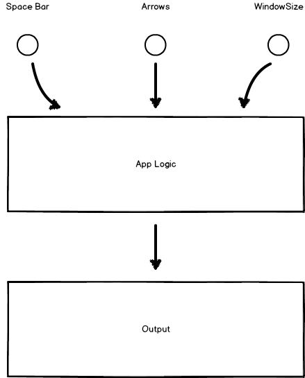

# Introduction to FRP

## Hello World

    import Graphics.Element exposing (..)

    main : Element
    main =
      show "Hello, World!"

[HelloWorld.elm](HelloWorld.elm)

Weird, why the double quotes ? Let's try to get rid of them...

### Improved Hello World

    import Graphics.Element exposing (..)
    import Text

    main : Element
    main =
      leftAligned (Text.monospace (Text.fromString "Hello World!"))

WTF? Let's delve into this issue a bit as it's also a way to take a quick look at types.

### The Hello World Conundrum

Let's look at `show`, it's defined in [`Graphics.Element`](http://package.elm-lang.org/packages/elm-lang/core/2.0.1/Graphics-Element) and it's type signature is:

    show : a -> Element

in fact `show` is defined as:

    show value =
    leftAligned (Text.monospace (Text.fromString (toString value)))

this looks almost like our improved Hello World except since the input to show can be any type, it first uses `toString` to convert `value` to a `String`.

## Simple Signals For Snake

### Wait What Are We Trying To Build?

Let's take a look at the final result.

[Snake.elm](Snake.elm)

### So What Are Signals?

Moreover, WTF is FRP?

> Functional reactive programming (FRP) is a programming paradigm for reactive programming (asynchronous dataflow programming) using the building blocks of functional programming (e.g. map, reduce, filter). FRP has been used for programming graphical user interfaces (GUIs), robotics, and music, aiming to simplify these problems by explicitly modeling time. ([Wikipedia](http://en.wikipedia.org/wiki/Functional_reactive_programming))

So for instance in our game...

