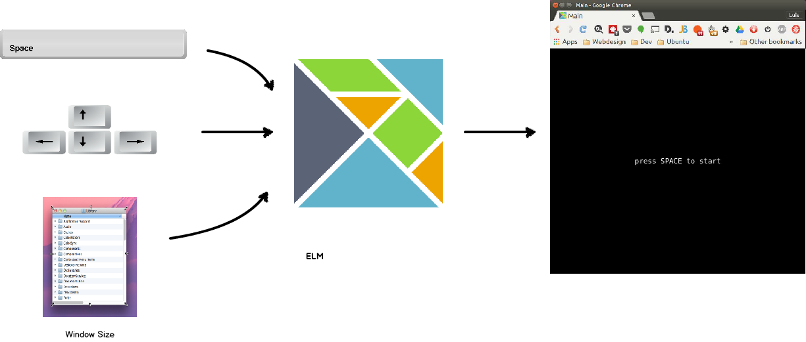

# Functional Reactive Programming in ELM

#### A very gentle introduction <!-- .element: class="fragment" data-fragment-index="1" -->

---

## First, things first

(Hello world...) <!-- .element: class="fragment" data-fragment-index="1" -->

----

## Hello World

    import Graphics.Element exposing (..)

    main : Element
    main =
      show "Hello, World!"

[Try it live!](http://localhost:8000/HelloWorld.elm) <!-- .element: target="_blank" -->

----

## What's up with the quotes ?

----

### Improved Hello World

    import Graphics.Element exposing (..)
    import Text

    main : Element
    main =
      leftAligned (Text.monospace (Text.fromString "Hello World!"))

[Try it live!](http://localhost:8000/ImprovedHelloWorld.elm) <!-- .element: target="_blank" -->

Let's delve into this issue a bit as it's also a way to take a quick look at types.

----

### Elm is statically typed

Let's look at `show`, it's defined in [`Graphics.Element`](http://package.elm-lang.org/packages/elm-lang/core/2.0.1/Graphics-Element) <!-- .element: target="_blank" --> and it's type signature is:

    show : a -> Element

in fact `show` is defined as:

    show value =
    leftAligned (Text.monospace (Text.fromString (toString value)))

this looks almost like our improved Hello World except since the input to show can be any type, it first uses `toString` to convert `value` to a `String`.

---

## Simple Signals For Snake

----

### Wait What Are We Trying To Build?

Let's take a look at the final result.

[Snake](http://localhost:8000/Snake.elm) <!-- .element: target="_blank" -->

----

### So What Are Signals?

Moreover, WTF is FRP?

> Functional reactive programming (FRP) is a programming paradigm for reactive programming (asynchronous dataflow programming) using the building blocks of functional programming (e.g. map, reduce, filter). FRP has been used for programming graphical user interfaces (GUIs), robotics, and music, aiming to simplify these problems by explicitly modeling time. ([Wikipedia](http://en.wikipedia.org/wiki/Functional_reactive_programming))

----

So for instance in our game, at a very high level...

----

Looking closer at what is going on with the space bar...

[Let's try it!](http://localhost:8000/Spaces.elm) <!-- .element: target="_blank" -->

----

And in code

    import Graphics.Element exposing (..)
    import Keyboard
    import Signal exposing (..)

    main : Signal Element
    main = map show Keyboard.space

---

## Let's look at more signals

----

### Keyboard arrows

We'll need these to move the snake around

    import Graphics.Element exposing (..)
    import Keyboard
    import Signal exposing (..)

    main : Signal Element
    main = map show Keyboard.arrows

[Let's try it!](http://localhost:8000/Arrows.elm) <!-- .element: target="_blank" -->

----

### Windows size

Since we want to center our display, we'll need to know the window dimensions.

    import Graphics.Element exposing (..)
    import Signal exposing (..)
    import Window

    main : Signal Element
    main = map show Window.dimensions

[Let's try it!](http://localhost:8000/WindowSize.elm) <!-- .element: target="_blank" -->

---

## Wrapping up signals

----

### The ELM architecture

    -- MODEL

    type alias Model = { ... }

    -- UPDATE

    type Action = Reset | ...

    update : Action -> Model -> Model
    update action model =
      case action of ...

    -- VIEW

    view : Model -> Html
    view = ...

----

### Wrapping up spaces

We want hitting the space bar to be one of the actions in our game.

    import Graphics.Element exposing (..)
    import Keyboard
    import Signal exposing (..)

    type Action = Space Bool

    spaces : Signal Action
    spaces = Space <~ Keyboard.space

    main : Signal Element
    main = map show spaces

[Let's try it!](http://localhost:8000/SpacesWrapped.elm) <!-- .element: target="_blank" -->
